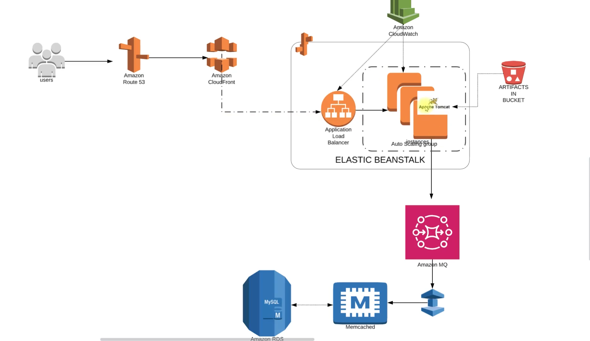
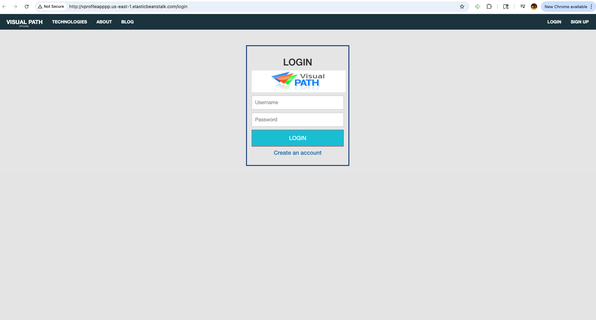
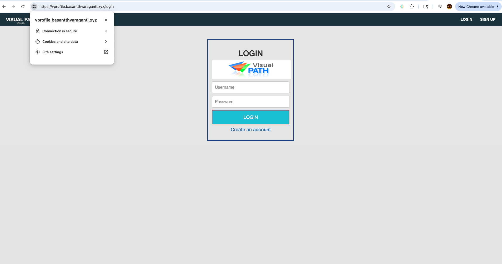

# Refactoring with AWS

Welcome to the **Refactoring with AWS** project! This repository is your guide to transforming traditional, complex infrastructures into modern, scalable, and cost-effective cloud-native solutions using Amazon Web Services. Whether you're a developer, architect, or cloud enthusiast, you'll find practical insights and hands-on examples to help you on your cloud journey.

---

## 🚀 Project Objectives

Our mission is to:
- Build flexible, scalable infrastructure with no upfront costs
- Embrace Infrastructure as Code (IaC) for repeatable, reliable deployments
- Leverage Platform as a Service (PaaS) and Software as a Service (SaaS) for agility
- Modernize legacy systems for the cloud era

---

## 🌐 Real-World Scenario

Imagine a project whose services run across physical, virtual, and cloud machines. These services might include:
- DNS, PostgreSQL, Oracle, Node.js, Windows Server, Apache Tomcat, LAMP stack, Java, NGINX, and more

Multiple teams—Cloud, Virtualization, Data Center Ops, Monitoring, and Sys Admins—work together to keep everything running smoothly.

---

## ⚠️ The Challenge

Traditional setups face several hurdles:
- High operational overhead
- Difficulty maintaining uptime and scaling
- Significant upfront (CapEx) and ongoing (OpEx) costs
- Manual processes that are hard to automate

---

## 💡 The Solution: Cloud Setup

By moving to AWS, we unlock:
- **Automation**: Streamline deployments and management
- **PaaS & SaaS**: Focus on building, not maintaining infrastructure
- **Infrastructure as Code (IaC)**: Version-controlled, repeatable environments
- **Pay-as-you-go**: Only pay for what you use
- **Flexibility**: Scale up or down as needed

All of this leads to easier, more efficient infrastructure management.

---

## 🛠️ AWS Services in Action

We use a suite of AWS services to replace and enhance traditional components:
- **Elastic Beanstalk**: Hosts Tomcat app servers, replaces NGINX load balancers, and automates VM scaling
- **S3/EFS**: Provides reliable, scalable storage
- **RDS**: Managed databases
- **Elastic Cache**: High-speed caching (Memcached/Redis)
- **Active MQ**: Managed message brokering
- **Route53**: Scalable DNS
- **CloudFront**: Global content delivery

All infrastructure is managed seamlessly in the AWS Cloud.

---

## 🏗️ Architecture Overview



The diagram above shows how users access the application through Route 53 and CloudFront, with traffic managed by an Application Load Balancer and Elastic Beanstalk (running Tomcat). Supporting services like RDS, Memcached, Amazon MQ, and S3 ensure the application is scalable, resilient, and cloud-native.

### Key Components
- **EC2 Instances**: Scalable compute for your applications
- **ELB**: Distributes traffic for high availability
- **Autoscaling**: Dynamically adjusts resources
- **EFS/S3**: Shared and object storage
- **RDS**: Managed relational databases
- **Elastic Cache**: In-memory caching
- **Active MQ**: Message brokering
- **Route53**: DNS management
- **CloudFront**: Content delivery network

This architecture delivers high availability, scalability, and performance for modern applications.

---

## 🔄 AWS vs. Traditional Infrastructure

| AWS Service         | Traditional Equivalent           |
|---------------------|----------------------------------|
| Beanstalk           | Tomcat EC2/VM                    |
| ELB in Beanstalk    | NGINX LB/ELB                     |
| Autoscaling         | None / Manual Scaling             |
| EFS/S3              | NFS / S3 / EFS                    |
| RDS                 | MySQL on VM/EC2                  |
| Elastic Cache       | Memcached on VM/EC2              |
| Active MQ           | RabbitMQ on VM/EC2               |
| Route53             | GoDaddy, Local DNS               |
| CloudFront          | None / Multi DC across world      |

AWS services not only replace but also enhance traditional infrastructure, offering automation, scalability, and global reach.

---

## 📚 About This Project

- Multi-tier web application stack ([VPROFILE] example)
- Refactored and re-architected for AWS Cloud
- Designed to boost agility and business continuity

---

## 📖 Project Overview

This repository demonstrates best practices for refactoring and modernizing applications using AWS. You'll find:
- Real-world refactoring examples
- Integration with AWS services (Lambda, S3, DynamoDB, and more)
- Infrastructure as Code (IaC) templates
- CI/CD pipeline blueprints
- Cost optimization strategies

---

## 🛠️ Getting Started

1. **Clone the repository:**
   ```bash
   git clone <repository-url>
   cd "Refactoring with AWS"
   ```
2. **Install dependencies:**
   - Python 3.8+ and/or Node.js (if applicable)
   - Install required packages as specified in each module
3. **Configure AWS credentials:**
   - Set up your AWS CLI with `aws configure`
   - Ensure your IAM user has the necessary permissions

## 📝 Flow of Execution

Here's a step-by-step guide to how the AWS environment is set up and deployed for this project:

**🔑 Key Pair Created:**
- Name: `vprofile-bean-key`
- Type: `rsa`
- Created: 2025/07/06 12:17 GMT-4

This key pair is used for secure login to your Beanstalk instances.

1. **Login to your AWS account**
2. **Create a key pair** for Beanstalk instance login (e.g., `vprofile-bean-key`)
3. **Create security groups** for ElastiCache, RDS, and ActiveMQ
4. **Provision core AWS services:**
    - RDS (Relational Database Service)
    - Amazon ElastiCache
    - Amazon ActiveMQ
5. **Create an Elastic Beanstalk environment**
6. **Update security groups** of backend resources to:
    - Allow traffic from the Beanstalk security group
    - Allow internal traffic as needed
7. **Launch an EC2 instance** for database initialization
8. **Login to the EC2 instance** and initialize the RDS database
9. **Adjust Beanstalk health checks** (e.g., set to `/login`)
10. **Add an HTTPS (443) listener** to the Elastic Load Balancer
11. **Build your application artifact** with backend information
12. **Deploy the artifact** to Elastic Beanstalk
13. **Create a CDN (CloudFront) with SSL certificate**
14. **Update DNS entries** (e.g., in GoDaddy DNS zones) to point to your AWS resources

This flow ensures a secure, scalable, and production-ready deployment on AWS.

### 🔒 Security Group: vprofile-backend-SG

- **Security group name:** vprofile-backend-SG
- **Description:** Security group for backend services
- **VPC ID:** vpc-04b1261bc49c7c0f8
- **Inbound rules:**
  - SSH (TCP, port 22) from allowed sources
  - All traffic (all protocols, all ports) from allowed sources
- **Outbound rules:**
  - Default (allow all)

This security group is essential for controlling access to backend resources such as EC2 instances, RDS, ElastiCache, and ActiveMQ. It ensures only authorized traffic can reach your backend services, improving the security posture of your AWS environment.

### 🗄️ Core AWS Backend Resources

#### 1. Amazon RDS (MySQL)
- **DB Identifier:** vprofile-rds-mysql
- **Engine:** MySQL Community
- **Region:** us-east-1a
- **Instance Type:** db.t3.micro
- **Status:** Available

This managed MySQL database instance provides reliable, scalable storage for application data.

#### 2. Amazon MQ (RabbitMQ)
- **Broker Name:** vprofile-rmq
- **Engine:** RabbitMQ
- **Instance Type:** mq.t3.micro
- **Deployment Mode:** Single-instance broker
- **Status:** Creation in progress (as of July 6, 2025, 14:22 UTC-4)

Amazon MQ enables robust message brokering for decoupled, scalable microservices.

#### 3. Amazon ElastiCache (Memcached)
- **Cache Name:** vprofile-elasticache-svc
- **Engine:** Memcached 1.6.22
- **Instance Type:** cache.t2.micro
- **Status:** Available

ElastiCache accelerates application performance by providing fast, in-memory caching.

#### 4. ElastiCache Subnet Group
- **Name:** vprofile-memcached-sub-group
- **VPC ID:** vpc-04b1261bc49c7c0f8
- **Description:** vprofile-memcached-sub-group

Subnet groups define which subnets ElastiCache nodes are deployed in, ensuring high availability and network control.

#### 5. ElastiCache Parameter Group
- **Name:** vprofile-memcache-para-...** (truncated for display)
- **Family:** memcached1.6
- **Global:** No
- **Description:** vprofile-memcache-para-...

Parameter groups allow you to customize engine settings for your ElastiCache clusters.

These resources form the backbone of your AWS backend, supporting high performance, scalability, and reliability for your application.

### 🛠️ Initializing the Application Database

After setting up your EC2 instance and RDS MySQL database, follow these steps to initialize your application database:

1. **Install the MySQL client:**
   ```sh
   sudo apt update && sudo apt install mysql-client -y
   ```
2. **Connect to your RDS MySQL instance:**
   ```sh
   mysql -h vprofile-rds-mysql.cs9642s4ahrr.us-east-1.rds.amazonaws.com -u admin -p
   ```
   - Enter your password when prompted.
   - You should see the MySQL monitor welcome message.

3. **Clone the vProfile project repository:**
   ```sh
   git clone https://github.com/devopshydclub/vprofile-project.git
   cd vprofile-project/
   ```
   - Verify the presence of the database backup file:
     ```sh
     ls src/main/resources/db_backup.sql
     ```

4. **Restore the database backup into your RDS instance:**
   ```sh
   mysql -h vprofile-rds-mysql.cs9642s4ahrr.us-east-1.rds.amazonaws.com -u admin -p accounts < src/main/resources/db_backup.sql
   ```
   - This will populate your database with the required tables and data.

5. **Verify the restoration:**
   ```sh
   mysql -h vprofile-rds-mysql.cs9642s4ahrr.us-east-1.rds.amazonaws.com -u admin -p accounts
   show tables;
   ```
   - You should see tables like `role`, `user`, and `user_role`.

These steps ensure your application database is ready for use with the vProfile project.

### 🛠️ Connecting to the RDS MySQL Database

After launching your EC2 instance and installing the MySQL client, you can connect to your Amazon RDS MySQL database as follows:

1. **Install the MySQL client:**
   ```sh
   sudo apt update && sudo apt install mysql-client -y
   ```
2. **Connect to the RDS instance:**
   ```sh
   mysql -h vprofile-rds-mysql.cs9642s4ahrr.us-east-1.rds.amazonaws.com -u Admin -p
   ```
   When prompted, enter your database password.

   - **Endpoint:** vprofile-rds-mysql.cs9642s4ahrr.us-east-1.rds.amazonaws.com
   - **Username:** Admin
   - **Password:** (use your secure password)

> **Note:** Never share your database password publicly. Store credentials securely using environment variables or AWS Secrets Manager in production environments.

### 🔐 Creating an IAM Role for Elastic Beanstalk

To enable your Elastic Beanstalk application to interact securely with other AWS services, you created an IAM role and attached the following AWS managed policies:

- **AdministratorAccess-AWSElasticBeanstalk**
- **AWSElasticBeanstalkCustomPlatformforEC2Role**
- **AWSElasticBeanstalkRoleSNS**
- **AWSElasticBeanstalkWebTier**

These policies grant the necessary permissions for Elastic Beanstalk to manage environments, interact with EC2 instances, send notifications, and perform other essential operations.

> **Tip:** Always follow the principle of least privilege. Attach only the permissions your application needs for security best practices.

### ⚙️ Configuring application.properties

After setting up your AWS resources and database, update the `application.properties` file in your vProfile project with the required credentials and connection details. This typically includes:

- RDS MySQL endpoint, username, and password
- ElastiCache (Memcached) endpoint
- RabbitMQ (Amazon MQ) endpoint and credentials
- Any other AWS resource endpoints or secrets needed by the application

**Example:**
```properties
# Database
spring.datasource.url=jdbc:mysql://<RDS-ENDPOINT>:3306/accounts
spring.datasource.username=<DB-USERNAME>
spring.datasource.password=<DB-PASSWORD>

# Memcached
memcached.servers=<ELASTICACHE-ENDPOINT>:11211

# RabbitMQ
rabbitmq.host=<MQ-ENDPOINT>
rabbitmq.username=<MQ-USERNAME>
rabbitmq.password=<MQ-PASSWORD>
```
> **Tip:** Never commit sensitive credentials to version control. Use environment variables or AWS Secrets Manager for production deployments.

This step ensures your application can connect to all required AWS services and function correctly in the cloud environment.

### 🚀 Application Deployment Success

Your application has been successfully deployed to AWS Elastic Beanstalk! Below is a screenshot of the live login page, confirming that all backend services and configurations are working as expected:



- **URL:** http://vprofileapppp.us-east-1.elasticbeanstalk.com/login
- The login page is accessible, indicating that the application is running and connected to all required AWS resources.

Congratulations on completing your cloud deployment journey!

### 🌐 Custom Domain Deployment Success

Your application is now live and accessible via your custom GoDaddy domain with HTTPS enabled!



- **Live URL:** [https://vprofile.basanthhvaraganti.xyz/login](https://vprofile.basanthhvaraganti.xyz/login)
- The secure connection and custom domain confirm that your DNS, SSL, and AWS deployment are all correctly configured.


### 🌍 AWS CloudFront Integration

To further enhance performance, security, and global reach, AWS CloudFront was configured as a Content Delivery Network (CDN) for the application. CloudFront distributes your application's static and dynamic content across edge locations worldwide, ensuring:

- **Faster load times** for users, regardless of their geographic location
- **Improved security** with HTTPS/SSL support and DDoS protection
- **Reduced latency** and offloading of traffic from your origin servers

By integrating CloudFront, your application delivers a seamless and secure experience to users everywhere.
---

## ▶️ Usage
- Explore the documentation in each module for step-by-step guides
- Use provided scripts and templates to deploy resources to AWS

---
